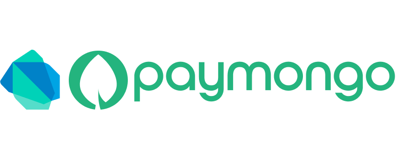

# PayMongo SDK
 

<center><h1>A dart implementation of PayMongo Client SDK.<h1></center>

## Flutter package for paymongo

The flutter package for paymongo will be in separate package. This is to separate
what endpoints to use in the frontend or backend APIs.

### Create Account
you can register your account here https://dashboard.paymongo.com/login.

### API Keys
Go to Developers and locate the _Public Key_ and _Secret Key_. 
copy the key and use it in your project.

### TODO
|                                   Payment                                   | Documentation | Production |
| :-------------------------------------------------------------------------: | :-----------: | :--------: |
|   [GCash](https://developers.paymongo.com/docs/accepting-gcash-payments)    |       🚧       |     ✅      |
|    [Debit/Credit](https://developers.paymongo.com/docs/accepting-cards)     |       🚧       |     ✅      |
| [PayMaya](https://developers.paymongo.com/docs/accepting-paymaya-payments)  |       ❌       |     ❌      |
| [Grab Pay](https://developers.paymongo.com/docs/accepting-grabpay-payments) |       🚧       |     ❌      |

_Let me know if you have concerns with the SDK by creating an [issue](https://github.com/ram231/paymongo_sdk/issues)_

## Usage

full [example](./example/lib/main.dart) project.

```dart
/// for dart standalone project usage
import 'package:paymongo_sdk/paymongo_sdk.dart'

void main() async {
    /// apiKey can be either public key or secret key.
    /// but do not use secret key in your front-end.
    
    final publicSDK = PaymongoClient<PaymongoPublic>(apiKey);
    final data = SourceAttributes(
    type: 'gcash',
    amount: amount,
    currency: 'PHP',
    redirect: const Redirect(
        success: "https://google.com/success",
        failed: "https://google.com/failed",
    ),
    billing: billing,
    );

    final result = await publicSDK.instance.source.create(data);
}

```

